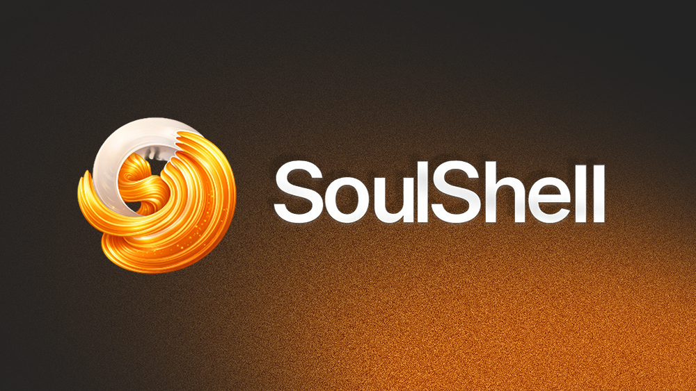

<div align="center">



# SoulShell

### Cognition OS for brains that refuse to behave.

A workspace that thinks **with** you, not **at** you. Built for neurodivergent minds, chaotic thinkers, and anyone whose brain doesn't fit in a spreadsheet.

[](https://soulshell.xyz)
[](https://x.com/soulshellai)
[](https://t.me/soulshellai)
[](LICENSE)

🪙 **$SHELL Token launches Monday, April 27, 2026 · 6 PM UTC · pump.fun**

</div>

---

## What is SoulShell?

Most productivity apps are built for neurotypical brains — rigid lists, checkbox grids, templates. That's great if your brain works in straight lines. If it doesn't, those tools become another source of guilt.

SoulShell is different. Three modules designed to match how chaotic brains actually work:

- **🧠 Workspace** — A visual canvas for scattered thoughts. Sticky notes you can drag, connect, and reorganize like a mind map.
- **💬 AI Mirror** — An AI that reflects your patterns instead of bossing you around. Vent, ramble, think out loud — it listens.
- **⚡ Synthesize** — One button reads everything (notes + mirror chat + tasks) and turns it into a personalized action plan.

---

## Tech Stack

- **Frontend:** Plain HTML / CSS (Tailwind CDN) / Vanilla JS
- **Backend:** PHP 7.4+ (no framework dependencies)
- **Database:** MySQL 5.7+ / MariaDB
- **AI:** Anthropic Claude Sonnet 4 API
- **Email:** Native SMTP (no PHPMailer, no Composer)
- **Hosting:** Tested on Hostinger shared hosting

No build step. No npm install. No framework churn. Just upload and run.

---

## Local Development Setup

### 1. Clone the repo

```bash
git clone https://github.com/soulshellai/soulshell.git
cd soulshell
```

### 2. Setup database

Import `database.sql` into your MySQL/MariaDB database:

```bash
mysql -u root -p your_database < database.sql
```

Or paste into phpMyAdmin → SQL tab → Go.

### 3. Configure credentials

Copy the template and fill in your own values:

```bash
cp api/config.example.php api/config.php
```

Edit `api/config.php` and set:
- Database credentials
- Anthropic API key ([get one here](https://console.anthropic.com))
- SMTP credentials for email OTP

### 4. Serve locally

Any PHP server works:

```bash
php -S localhost:8000
```

Open `http://localhost:8000` in your browser.

---

## Production Deployment (Hostinger)

1. Upload all files except `api/config.example.php` to `public_html/`
2. Rename `config.example.php` → `config.php` on server (or upload manually)
3. Fill in real credentials in `config.php`
4. Import `database.sql` via hPanel → phpMyAdmin
5. Test: open your domain, click "Launch App", try email OTP flow

---

## Project Structure

```
soulshell/
├── banner.png              # Repo banner
├── index.html              # Landing page
├── dashboard.html          # Main app (SPA)
├── tokenomics.html         # $SHELL token info
├── terms.html              # Terms of Service
├── privacy.html            # Privacy Policy
├── risk-disclosure.html    # Risk disclosure for $SHELL
├── database.sql            # MySQL schema + migrations
├── api/
│   ├── index.php           # REST API (24 endpoints)
│   └── config.example.php  # Config template (copy to config.php)
├── .gitignore
├── LICENSE
└── README.md
```

---

## The $SHELL Token

SoulShell launches its utility token `$SHELL` via a **100% fair launch on pump.fun**.

- **No presale.** No VC. No insider allocation.
- **95% fair launch** via pump.fun bonding curve
- **~5% dev bag** (publicly disclosed wallet, bought from curve with dev's own SOL)
- **LP auto-burned** at $69k market cap migration to Raydium
- **Mint & freeze authorities revoked** by default

### Utility Tiers (Post-Launch)

Holding $SHELL unlocks features inside SoulShell:

| Tier | Hold | Unlock |
|------|------|--------|
| 🟠 **Activated** | 5,000 $SHELL | Premium AI (Claude Opus access) |
| 🟠 **Infinite** | 25,000 $SHELL | Unlimited workspaces |
| 🟠 **Genesis** | 100,000 $SHELL | Governance voting + early access |

The product is **free forever**. Token is a premium tier unlock + governance mechanism, not a paywall.

See [tokenomics.html](tokenomics.html) for full details. Read [risk-disclosure.html](risk-disclosure.html) before participating.

---

## Contributing

This project is a solo side project turned community experiment. PRs welcome if you:

- Fix bugs
- Improve accessibility
- Add language translations
- Refactor messy code (there's plenty)

Before opening a PR, open an issue to discuss. I work slow and ship fast — sometimes at the same time.

---

## License

MIT — do what you want, just don't pretend you wrote it.

---

## Acknowledgments

Built by people with brains that don't behave, for people with brains that don't behave.

If this resonates, come say hi on [Twitter](https://x.com/soulshellai) or [Telegram](https://t.me/soulshellai).

🧡

---

<div align="center">

**[soulshell.xyz](https://soulshell.xyz)** · Built with care for chaotic minds

</div>
